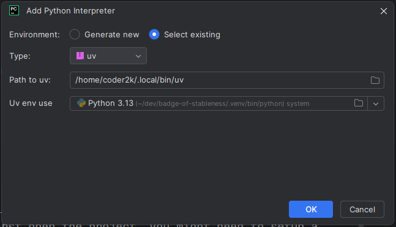

# Badge of Stableness

This is my 2025 rewrite of a game I made in 2003. Badge of Stableness is a 2D turn-based strategy game.

## Downloading

To download the project, use git to clone the repository.

```bash
git clone git@github.com:mgerhold/badge-of-stableness.git
```

Or if you didn't create SSH keys, you can clone via HTTPS:

```bash
git clone https://github.com/mgerhold/badge-of-stableness.git
```

## Install Requirements

The project uses [uv](https://docs.astral.sh/uv/) by Astral. They describe uv like so:

> An extremely fast Python package and project manager, written in Rust.

To install the tool, run the following command if you're on
Linux:

```bash
curl -LsSf https://astral.sh/uv/install.sh | sh
```

If you're on Windows, run this in your terminal:

```ps
powershell -ExecutionPolicy ByPass -c "irm https://astral.sh/uv/install.ps1 | iex"
```

Inside the repository, run this for the initial installation:

```bash
uv sync
```

## Development

I suggest using [JetBrains PyCharm](https://www.jetbrains.com/pycharm/) for development. When you first open the
project, you might need to setup a Python interpreter. Follow these steps to configure the interpreter:

1. In the bottom right corner (inside the status bar), click on "<No interpreter>" → "Add New Interpreter" → "Add Local
   Interpreter"
2. Choose "Select existing", select "uv" as the type. Under "Uv env use", navigate to
   `<repo directory>/.venv/bin/python` to select the uv interpreter.

   

3. Click "OK" to close the dialog.

The project includes a run configuration called "Main" that is directly usable from within the IDE. So you should simply be able to hit the run button to start the game.

### Formatting, Linting, and Type Checking

To check the formatting (using the ruff formatter), run the linter (ruff) and the type checker (pyright), use this command:
```bash
uv run check
```

To automatically apply the formatting and auto-fixes by the linter, run this command:
```bash
uv run fix
```
